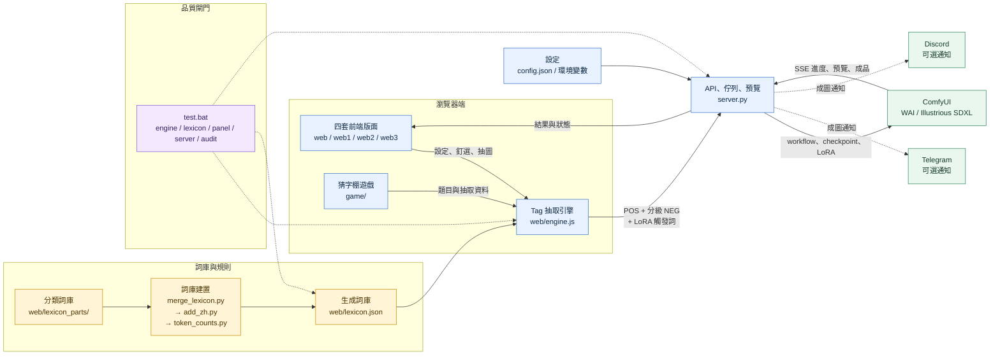

# 排字匣 · Danbooru case

本機隨機抽一套 Danbooru 標籤，立刻丟進 ComfyUI（WAI / Illustrious）生圖。

畫面上看到的是中文。真正送給 Comfy 的 POS 仍是英文 tag。滑鼠停在中文上會顯示英文。

四套版面（原版／暗房／活字樓／抽籤棚）抽牌規則相同，只是排版不同。詞庫和引擎都在 `web/`。

> **成人向。** 這個工具會產生成人內容。詞庫和負向 prompt 會擋 `loli`、`shota`、`teen`、`child`。
> 只在自己的機器上跑，伺服器預設只收 loopback 和 Tailscale 的連線。

## 架構總覽



實際生圖的執行路徑是「前端設定／釘選 → `engine.js` 抽出 POS → `server.py` 組合
分級負面與 workflow → ComfyUI → 預覽／成品回到前端」。詞庫建置與測試是獨立的
驗證路徑，不會在每次抽圖時重新生成詞庫。

---

## 你需要先有什麼

| | 版本 | 為什麼 |
|---|---|---|
| **Python** | 3.9 以上 | 跑 `server.py`。沒有第三方套件，標準函式庫就夠 |
| **ComfyUI** | 跑在 `http://127.0.0.1:8188` | 真正生圖的是它 |
| **SDXL checkpoint** | 建議 WAI / Illustrious 系列 | 詞庫是照 Danbooru tag 調的 |
| 瀏覽器 | 近三年的 Chrome / Edge / Firefox / Safari | 用到 `:has()`、`popover`、`oklch()` |
| Node.js（選用） | 18 以上 | 只有跑抽牌測試才需要 |

## 五分鐘上手

```bash
git clone https://github.com/bosen12/danbooru_tag_random.git
cd danbooru_tag_random
```

**1. 先把 ComfyUI 開起來**，確認瀏覽器打得開 <http://127.0.0.1:8188>。

**2. 告訴排字匣你的 checkpoint 叫什麼。** 這是新 clone 唯一一定要改的東西——預設值是作者機器上的檔名，你的一定不一樣。名字要跟 ComfyUI 的 `CheckpointLoaderSimple` 下拉選單裡**一模一樣**（含子資料夾）。

Windows：

```bat
set COMFY_CKPT=waiIllustriousSDXL_v170.safetensors
```

macOS / Linux：

```bash
export COMFY_CKPT=waiIllustriousSDXL_v170.safetensors
```

不確定名字？先直接跑第 3 步。checkpoint 對不上時，黑窗會把 ComfyUI 現有的清單印出來給你挑。

**3. 開伺服器。**

Windows 可以在檔案總管直接雙擊 `.bat`（不要用記事本打開），會自動找 `py -3` 或 `python` 並開瀏覽器：

| 雙擊這個 | 畫面 | 網址 |
|----------|------|------|
| `start.bat` | 原版詞庫工作臺 | http://127.0.0.1:8787 |
| `start-darkroom.bat` | 暗房：上面放大機井，右邊機盤，下面詞庫 | http://127.0.0.1:8788 |
| `start-typefloor.bat` | 活字樓：抽屜撿字、右邊校樣付印 | http://127.0.0.1:8789 |
| `start-stall.bat` | 抽籤棚：衣繩拍立得、櫃檯抽籤 | http://127.0.0.1:8790 |
| `start-game.bat` | 猜字棚：看圖猜 tag 的遊戲 | http://127.0.0.1:8791 |
| `start_lora_manager.bat` | LoRA Manager（獨立埠，從 flux2klein 啟動） | http://127.0.0.1:7861/loras |

任何系統都可以直接跑（macOS / Linux 只有這條路）：

```bash
python3 server.py
```

然後開 <http://127.0.0.1:8787>。要換版面就加 `WEB_DIR`：

```bash
WEB_DIR=web1 PORT=8788 python3 server.py
```

視窗不要關。改過程式後請 **Ctrl+F5**。

## 設定

機器專屬的東西（ComfyUI 在哪、模型和 LoRA 資料夾在哪）都在 **`config.json`**，不用改程式。

```bash
cp config.example.json config.json
```

然後把 `config.json` 裡的路徑改成你自己的。`config.json` 已經 gitignore，不會被推出去；
`config.example.json` 才是版控裡的範本。每一項留空就退回內建預設值。

新 clone 通常只要 ComfyUI 開在 `http://127.0.0.1:8188`。底模清單改問 ComfyUI，不必填安裝路徑。畫面右上「Comfy…」或「工作流」可改網址、匯入自己的 API workflow。

若清單仍對不上，再改：

| `config.json` 的位置 | 說明 |
|---|---|
| `comfy.ckpt` | 內建 workflow 的預設底模檔名，要跟 ComfyUI 選單裡的字**一模一樣** |
| `paths.loraRoot` | LoRA 收藏根目錄。**留空的話會改問 ComfyUI**，見下面 |

### LoRA 清單：三種設定深度

| `loraRoot` | `loraFolders` | 結果 |
|---|---|---|
| 留空 | — | **問 ComfyUI 要清單**，它認得的全都列出來。能選、能送進 workflow，但沒有預覽圖和觸發詞（那要讀本機檔案旁邊的 metadata） |
| 有填 | 留空 | 掃那個資料夾底下**所有**子資料夾，外加直接放在根目錄的鬆散檔案。分類就是資料夾名字 |
| 有填 | 有填 | 只掃你列出來的那幾個資料夾 |

換句話說**兩個都不填也能用**。清單為什麼是空的、或為什麼沒有預覽圖，畫面上會直接講。

`comfy.checkpointDir` 沒填 → 底模預覽圖沒有，清單仍問 ComfyUI。生圖本身不受影響。

### 用自己的 ComfyUI workflow

預設仍是專案內建的 Illustrious 流程。要改用自己的圖：

1. 在 ComfyUI 用 **檔案 → 匯出工作流 (API)**（不是一般 Save）。
2. 點狀態列的 Comfy 指示燈或「工作流」，把 JSON 拖進面板（或選檔）。
3. 指定 Positive Prompt 要寫進哪個 node / input。其餘欄位預設 Keep workflow value。
4. Generate 只改 mapping 指定的欄位，原始 JSON 不會被改。

一般 ComfyUI workflow（有 `nodes` / `links`）會被拒絕並提示改匯出 API 格式。複雜圖（ControlNet、upscale、custom nodes）只要不刪 node，都可以只注入 prompt。

其他常用的：`comfy.api`（ComfyUI 位置，畫面也可以改）、`comfy.checkpointDir`（只給底模預覽圖）、
`server.port` / `server.host` / `server.allowNet`、`paths.webDir`（版面 `web`／`web1`／`web2`／`web3`）、
`client.streamIdleMs`（Comfy 靜默多久就放棄該張；**慢顯卡例如 AMD ROCm 建議調大**，見〈跑到一半自己停〉）。

環境變數仍然可用，而且**優先於 `config.json`**，所以既有的啟動腳本不會壞：

| 環境變數 | 預設 | 說明 |
|----------|------|------|
| `COMFY_CKPT` | `illurtrious\waiIllustriousSDXL_v170.safetensors` | **新 clone 一定要改。** 要跟 ComfyUI 選單裡的字一樣 |
| `COMFY_API` | `http://127.0.0.1:8188` | ComfyUI 位置 |
| `WEB_DIR` | `web` | 版面：`web`／`web1`／`web2`／`web3` |
| `PORT` | `8787` | |
| `HOST` | `127.0.0.1`（`start*.bat` 設成 `0.0.0.0`） | |
| `ALLOW_NET` | `127.0.0.0/8,100.64.0.0/10` | 逗號分隔 CIDR。家用網要開要自己加 |
| `LORA_ROOT` | `E:\Comfyui\loras` | LoRA 收藏根目錄。底下要有 `style`／`Character`／`HENTAI`／`illus` |

Telegram 的 bot token **不走環境變數**，在畫面右上角的齒輪面板填，存進 `.secrets/telegram.json`（已 gitignore）。見下面〈送到 Telegram 頻道〉。

四套版面都有「選 LoRA」大面板（兩格、分類／搜尋／觸發詞／強度），跟 flux2klein 暗房同一套。生圖時會把勾到的觸發詞拼進 POS，並在 workflow 插入 `LoraLoader`。

LoRA Manager 是獨立程式（埠 7861），不在這個 MIT repo 裡（它是 GPLv3，在 `C:\projects\flux2klein\lora-manager`）。雙擊 `start_lora_manager.bat` 會去啟動那一份。在 Manager 裡點「送到 workflow」，開著的排字匣分頁會自動選入。

`server.py` 會讀 `config.json`（環境變數優先）。換 checkpoint／換埠也可以只靠上面這張表，不改程式。

生圖參數（`steps` 25、`cfg` 6.5、`euler_ancestral`）寫死在 `server.py` 上方的常數，要改就改那裡。

負向 prompt 寫在 `web/lexicon.json` 的 `negative`（來源是 `scripts/merge_lexicon.py`）。詞庫載入失敗時 `server.py` 才用內建後備字串。

即時預覽需要 Comfy 開著 latent 預覽（Preview method：Latent2RGB 或 TAESD）。

## 3D 工作室（可選）

桅杆上多了一顆 **3D** 的切換鈕。按下去會把畫面換成一個深夜工作室：桌上的螢幕、
字卡盒、模型櫃、牆上的作品、控制台、通訊裝置、分析儀各自對應一個功能，點下去
鏡頭會運到那個東西前面，然後把**原本那個面板**帶出來。

要講清楚的是：**3D 不是另一套介面，是同一套介面的另一種走法。** 面板裡的東西就是
平面工作台上的那些 DOM 節點本身（被搬進面板，關掉再搬回去），不是複製品。所以在
3D 裡釘的字，切回平面立刻就在；生圖生到一半切過去，看到的是同一個任務同一個進度。
切換不會重新整理網頁，也不會重建 Tag 引擎或動到 RNG。

| 想要什麼 | 怎麼做 |
|---|---|
| 這次用平面 | `http://127.0.0.1:8787/?view=2d` |
| 這次用 3D | `http://127.0.0.1:8787/?view=studio` |
| 以後都照上次 | 不帶參數就好，選擇記在 localStorage |

網址指定的優先於記住的選擇。**預設是平面工作台** —— 沒主動選過 3D 就不會自己跑進去。

three.js（MIT，附在 `web/vendor/three/`）是**按需下載**的：不進 3D 就完全不會抓，
所以平面那一側的載入時間一點都沒變。沒有 WebGL、系統要求節省流量、或 3D 連續出錯時，
會自動留在平面工作台並在狀態列說一句，不會卡在載入畫面，資料也不會掉。

場景目前是**程式畫出來的替代房間**，不是完成品 —— 真正的 Blender 模型還沒做。
規範、必要的節點命名與換模型的步驟寫在 `web/studio/scene/README.md`。

## 手機 / 區網

`start*.bat` 會把伺服器綁在 `0.0.0.0`（本機瀏覽器仍開 `127.0.0.1`）。請求只收 loopback 和 Tailscale（`100.64.0.0/10`），家裡 Wi-Fi / 熱點 / WSL 會 403。手機走 Tailscale 時用黑窗印出的 `Tailscale http://100.x.x.x:埠/`。防火牆若跳出，允許存取。只想本機聽可設 `HOST=127.0.0.1`。

## 跑不起來時

**bat 一閃就關 / 打不開**

- 請用英文檔名那四個 `start*.bat`。中文檔名（`啟動.bat` 等）只是呼叫英文檔，有的 Windows 會讀錯。
- 必須已安裝 Python 3，安裝時勾 **Add python.exe to PATH**。也可在終端機先試 `py -3 --version`。
- 不要把 bat 複製到別的資料夾再點；它要跟 `server.py` 同一層。
- 確認不是「用 Python 打開」而是「用命令提示字元」執行。
- 仍不行就在本目錄手動跑 `py -3 server.py`，錯誤訊息會留在畫面上。

**右上角一直顯示「Comfy 未連上」**

ComfyUI 沒開，或不在 `COMFY_API` 指的位置。先用瀏覽器確認 <http://127.0.0.1:8188> 打得開。

**黑窗印出「找不到 checkpoint」**

照它印出來的清單挑一個，設進 `COMFY_CKPT`。

**畫面上寫「詞庫載入失敗」**

`web/lexicon.json` 不見了或壞了。重跑 `python scripts/merge_lexicon.py` 和 `python scripts/add_zh.py` 重建。

## 測試

```bash
node scripts/test_engine.mjs
python scripts/test_server.py
```

Windows 也可以雙擊 `test.bat` 跑完整套件。它會依序驗證抽牌與互斥、衣著可達性、hard rule 雙向性、猜 tag 遊戲、support shadow、r42 gold 對齊，以及伺服器網段白名單與 Comfy 代理；都不需要開 ComfyUI。

## 授權

MIT，見 [LICENSE](LICENSE)。詞庫裡的 tag 名稱來自 Danbooru，生成內容的責任在使用者自己。

---

## 一次抽圖在做什麼

按「抽並生圖」（暗房叫「曝光」，活字樓叫「付印」，抽籤棚叫「抽一籤」）時，**每一張都重新抽一套 POS**，然後排隊送給 Comfy（一次一張）。「一次幾張」旁邊的開關是「同一個人」：預設關。打開後第 1 張定臉，後面鎖髮／瞳／胸或男體型種族，衣場姿勢照抽。一次只有 1 張時去開，會自動改成 2 張。第 2 張起卡片左上角打「同 #1」。卡片上會先出現這張的中文 POS。抽樣過程顯示進度和 Comfy 的即時預覽，完成後換成成品、進度條拿掉。圖片格子一開始就依寬高鎖定比例，不會先拉很高再跳回來。

抽牌順序固定是：

1. **誰在畫面上**（幾個女、幾個男）
2. **尺度**（這張有多色情：誘惑／走光／性愛）
3. **時代**（現代、古中國、中世紀…）
4. **你釘選的 tag 一定進去**
5. 再依「每段抽幾個」補牌。補的時候會先佔骨架，免得圖裡沒頭髮顏色、沒衣服、性愛卻沒體位：
   - 特徵：髮長、髮色、瞳色、髮型；有女人時再加胸型。有男人時約四成會抽一種種族（哥布林、獸人、貓男…），同類只留一個；也可能抽到醜男、胖男、宅男這類長相
   - 服裝：至少一件衣服（全裸除外）。連身就不再疊長褲／襯衫；上衣可配下身。飾品最後
   - 姿勢：先身體姿勢、鏡頭、視線。誘惑／走光會抽一格活動（購物、煮飯、游泳…）。走光動作要對應身上的衣服（沒有對應就改抽掀衣／脫衣／走光，不亂掀不存在的泳衣）。尺度是性愛：兩人以上補體位，單人補自慰，不抽逛街開車。磨鏡只在沒有男性時抽
   - 場景：室內或室外、白天或晚上、一個地點
   其餘格子才隨機，所以每張仍會不一樣
6. 最後對帳：互斥的只留一個，父子可以一起留

送給 Comfy 的 POS 順序是：人數 → 長相 → 衣服 → 姿勢 → 場 → nsfw → 風格 → 畫質。衣服排在姿勢前面，讓成套服裝落在 CLIP 第一塊。WAI / Illustrious 的品質詞放最後。

規則在左欄（或暗房右邊機盤、抽籤棚櫃檯／棚規）。中間詞庫是「有哪些字可以抽／可以釘死」。

---

## 無限抽

「一次幾張」旁邊那顆開關。打開就一直抽，直到你按停。

- 一輪照「一次幾張」跑，跑完自動接下一輪。**「一次幾張」沒有上限**，想一輪排 50 張也行。
- 按下去變「停」。**停是立刻斷**：正在畫的那張也一起中斷，跟左欄的「取消」同一個動作。鍵盤按 `I` 也可以開關。
- 單張失敗只跳過、繼續下一張；**連續 3 張失敗會自動停**，狀態列會寫原因（Comfy 掛了、報什麼錯）。掛整晚不會空轉。
- 開跑前會先 ping 一次 ComfyUI，連不上就不開（探活本身十秒逾時，不會卡在那裡）。
- **Comfy 靜默 90 秒就放棄那一張**，算一次失敗。伺服器在等 Comfy 的時候每五秒送一則心跳，所以「還在載底模」和「那條連線死了」分得出來，不會出現按鈕一直轉卻什麼都沒發生的狀況。
- 抽圖途中真的丟出沒接住的錯誤時，按鈕會放開、無限抽會停、狀態列直接寫出錯誤內容，不會靜靜凍住。

畫面上**固定八格**。第 9 張直接在第 1 格原地重畫，第 10 張換第 2 格，以此類推——整片牆只有一格在變，不會一直位移、也不會抱著捲軸跑。正在畫的那格有硃砂色亮框。按「抽並生圖」不再清空畫面，就是一面持續輪替的八格牆。**但按過「停」或「取消」之後，下一次抽圖會先把牆清乾淨再重來**，不會跟上一輪的半成品混在一起。

## 必抽某一類

每個小分類（誘惑、走光、髮色、飾品、地點…）標題旁邊有一組 `必抽 − 1 ＋`。設成 1 以上，那一類每張都至少要抽到這麼多個，小分類標題會亮起來。上限 20，設 0 就是關。設定跟釘選一樣存在瀏覽器裡。左欄的「**清除必抽**」可以一次把所有小分類歸零。

規矩，由大到小：

1. **互斥絕不破。** 必抽 2 不會給你兩個互斥的字（髮色只有一個槽，就只會有一個），差幾個算幾個。
2. **權限大於時代。** 現代場必抽「時代服裝」也抽得到古裝；一般抽牌仍然照時代擋。
3. **尺度和女／男是硬牆。** 尺度只開誘惑時必抽「性愛」抽不到；只開女時必抽「體型・男」拿不到任何男性限定的字。必抽也不准靠 `implies` 繞過去。
4. **已關閉、已選的跳過，接著往下抽。**
5. **名額算進「每段抽幾個」。** 服裝段設 5、必抽「上衣」2，就是先抽這 2 個，剩下 3 個照原本邏輯補。

必抽的字在「場景服不服貼」和最後對帳這兩關**比照釘選**——你明講要的東西，場景規則讓路。但身體對不上時仍然讓步（例如性愛體位跟雙手抱胸不能同時成立），這種時候卡片上會寫「必抽沒抽滿：誘惑 2/3」，不會硬湊出手在兩個地方的圖。

## 送到 Telegram 頻道

右上角齒輪。填 bot token 和 chat id，打開「每張成圖自動送」，之後每張成圖都會投到頻道。

| 欄位 | 填什麼 |
|------|--------|
| Bot token | 跟 [@BotFather](https://t.me/BotFather) 要的那串 `123456789:AAE…` |
| Chat ID | 公開頻道填 `@帳號`；私人頻道填 `-100` 開頭的數字 |

bot 要先加進該頻道並給發文權限，否則 Telegram 會回 `chat not found` 或 `not enough rights`。填完按「送一則測試」，面板會當場把 Telegram 的回覆貼給你看。

**token 放哪**：存在 `.secrets/telegram.json`，**由 `server.py` 保管**。`.gitignore` 擋掉整個 `.secrets/`，所以不會進 git。面板重開只看得到末四碼，token 本體不會回傳瀏覽器；token 欄位留空就是沿用已存的。要換機器就把那個檔複製過去，或重填一次。

送圖細節：

- 走 `sendPhoto`，caption 放 `seed · 尺寸 · 中文 POS · 英文 POS`。Telegram 的 caption 上限 1024 字，超過就把英文 POS 拆成緊接在圖下面的一則回覆，不截斷。
- 抽圖**不等**送圖。伺服器收下就回，實際上傳在背景執行緒排隊，每則間隔 1 秒（頻道大約 20 則/分鐘）。遇到 429 會退避 5 秒重試一次。
- 送失敗不會中斷抽圖，也不會吵你，失敗次數和最後一則錯誤都記在面板上。
- 排進佇列的那張，圖右下角會蓋一枚紙飛機。

## 畫面裡有誰（女／男）

這三顆跟時代一樣，一次只亮一種：

| 你點 | 圖裡 | 詞庫 |
|------|------|------|
| **女** | 只有女生，不會抽到 `1boy` | 男生的字收起來（1個男性、鬍鬚、男制服、種族、醜男…） |
| **男** | 只有男生 | 女生的字收起來 |
| **不限** | 有時女、有時男、有時一起 | 兩種都看得到 |

不要去人數裡釘「1個男性」來選性別。若你已經釘了男生的字，會出現橘色提示：釘選仍會進圖。

切女／男、換時代、搜尋只把不合的字藏起來，不會把詞庫拆掉重畫。

### 尺度（有多色情）

可複選，至少留一個。每張從勾著的裡面骰一種。

- **活動**：日常（購物、煮飯、游泳），沒有走光或做愛
- **誘惑**：穿著、氣氛，也會抽一格活動
- **走光**：衣服沒穿好、露出，也會抽一格活動
- **性愛**：插入、體位；不抽逛街開車這類日常活動
- **混合**：誘惑＋走光＋性愛（不含活動）

只要日常：只勾活動。釘選的活動在性愛裡也會留下。

**抽職業**（尺度底下那顆）預設關。打開後每張抽一種職業，並帶配套衣服。

左欄有現成釘選組合（OL 辦公室、溫泉、泳池…）。點一下會換掉目前釘選。「存目前釘選」可自訂，按 × 刪。

### 運動組合

底下自成一組的 13 顆按鈕，寫的是**運動**不是場地：籃球、網球、足球、棒球、排球、羽球、桌球、游泳、拳擊、田徑、高爾夫、自行車、射箭。

點一下，整套一次進「必進這張圖」——場地、器材、服裝一起。旁邊的「動作也必進」預設關閉；打開後，活動也會一起釘選。預設關閉時由抽牌按尺度決定（見下面）：

| 運動 | 必進 POS（場地／器材／服裝） | 抽牌時帶的活動 |
|---|---|---|
| 籃球 | `basketball court` `basketball (object)` `basketball uniform` `sneakers` | `playing sports` |
| 網球 | `tennis court` `tennis racket` `tennis ball` `tennis uniform` `sneakers` | `tennis` |
| 足球 | `soccer field` `soccer ball` `soccer uniform` `cleats` | `soccer` |
| 棒球 | `baseball stadium` `baseball (object)` `baseball bat` `baseball uniform` `baseball cap` `cleats` | `playing sports` |
| 排球 | `school gym` `volleyball (object)` `volleyball uniform` `knee pads` `sneakers` | `playing sports` |
| 羽球 | `school gym` `badminton racket` `shuttlecock` `sportswear` `sneakers` | `badminton` |
| 桌球 | `school gym` `table tennis paddle` `table tennis ball` `sportswear` `sneakers` | `table tennis` |
| 游泳 | `pool` `competition swimsuit` `swim cap` `goggles` | `swimming` |
| 拳擊 | `boxing ring` `boxing gloves` `boxing shorts` | `boxing` |
| 田徑 | `running track` `track uniform` `sneakers` | `track and field` |
| 高爾夫 | `golf course` `golf club` `golf ball` `sportswear` | `golf` |
| 自行車 | `bicycle` `bicycle helmet` `sportswear` `sneakers` | `riding bicycle` |
| 射箭 | `bow (weapon)` `arrow (projectile)` `sportswear` | `archery` |

**「動作也必進」關閉時，活動 tag 不釘死，看那張圖的尺度決定。** `playing sports`／`tennis`／`badminton` 這類動作由抽牌決定：

- 抽到**活動／誘惑／走光**尺度 → 自動帶上這個運動自己的活動（排球場會配「做運動」，不會配「逛街」）。
- 抽到**性愛**尺度 → 讓位給體位。

所以選「活動＋性愛」會**兩種輪流出**：一半是打球的圖、一半是性愛的圖，球衣球場球具兩邊都在。打開「動作也必進」後，活動會釘進 POS；它與性愛動作互斥，因此適合想固定運動畫面的情況。

如果你自己手動把活動釘進必進 POS 又選性愛，左欄會直接告訴你「這種活動跟性愛動作不能並存，所以這張抽不到性愛」，並保留你的釘選不動——不會偷偷幫你刪掉。

**器材本身會限定場地。** 腳踏車、弓、球拍不會出現在浴室或臥室。判斷只看器材不看衣服——穿排球服在廚房是可以的，在浴室騎腳踏車不行。

**每個字都可以單獨拿掉。** 在「必進這張圖」點掉其中一個（例如球鞋），就只有那一個不再必進，其他照舊，而且**不會被自動加回來**——重新整理、存讀檔、preset 同步都不會。preset 不是綁死的包裹。

注意：在必進區點掉一個字**只是取消必進，不等於封鎖**。那個字之後仍然可能被隨機抽到。真的不想看到它，要到下面的詞庫把它封鎖。

按鈕有三種狀態：

| 狀態 | 樣子 | 再點一下會 |
|------|------|-----------|
| 整套都在 | 實心 | 把整套拿掉（你自己另外釘的字留著） |
| 只剩一部分 | 斜線底紋 | 補齊整套 |
| 一個都沒有 | 空心 | 套用整套 |

partial 狀態重新整理之後還在。系統會記住「上一個組合實際新增了哪些 tag」；換到另一個運動時只移除那些 tag，不會誤刪原本手動釘選的戶外、帽子、球鞋或身份。舊版存檔沒有這份來源紀錄時採保守策略，不推測、也不整套刪除。

**抽牌時的運動互斥**靠「運動身分」判斷：每個帶身分的 tag 記著哪些運動用得到它，場上所有這種 tag 的交集空了就擋掉。所以 `tennis racket` + `tennis ball` 本來就共存（兩個都只屬於網球），但籃球場不會混進足球；球鞋、運動服這類通用裝備不帶身分，不會害任何運動互斥。

規則全部寫在 [`web/sports.js`](web/sports.js) 一個檔案裡，`BUILTIN_PRESETS`、互斥判斷、活動場地、測試案例都從它算出來，不會有幾份清單互相失同步的問題。

所有 tag 都經 Danbooru 官方 API 核實（`category=0`、`post_count>0`、非 deprecated）。要重新核實：

```bash
node scripts/verify_danbooru_tags.mjs
# 額外列出 2025 年之後才建立的 tag（只警告，不判無效）
node scripts/verify_danbooru_tags.mjs --max-created 2025
```

刻意不用的：`basketball`／`baseball`（deprecated）、`volleyball`（已 alias）、`volleyball court`／`cycling`／`golf uniform`／`tennis shoes`／`archery range`／`ice rink`（post_count 0）、`baseball glove`（alias，正解 `baseball mitt`）、`arrow`／`yumi`（deprecated），以及不存在的 `ski slope`。`basketball (sport)` 那三個雖然有效，但建立年份較新，這版採用較成熟的舊 tag。Danbooru 的建立年份不等於 WAI Illustrious 的訓練截止日，因此驗證器只提供可調年份警告，不把它當有效性結論。

### 時代

決定這張圖的年代和場景。

- 第一次打開預設**現代**。點**一個**時代，其他會關。例如點中世紀＝城堡、鎧甲，不要現代街景。
- **混合**＝每張隨機擲一個年代。
- 地點會帶室內或室外。客廳不會跟「室外」同時出現。
- 古中國不會抽到洋裝、比基尼；江戶走和服；現代才有襯衫、牛仔褲。

電競椅、客廳、手錶、胸罩這類現代東西，沒釘選時不會進古中國／中世紀／江戶。顏色變體跟著父類走（藍領帶＝領帶的年代）。

你釘的衣服**一定進圖**。若跟年代不合（中世紀＋比基尼／胸罩）：

- 時代仍走你點的那個（中世紀）
- 場景會蓋上鎧甲、城堡
- 比基尼也留著
- 畫面上會出現橘色提示

若要純中世紀、不要比基尼，把比基尼的釘選清掉。

### 抽取不變式稽核

`test.bat` 會跑 `scripts/audit_draw_invariants.mjs`，抽 2000 張檢查輸出有沒有自相矛盾。要更深的稽核自己加張數：

```
node scripts/audit_draw_invariants.mjs 20000
```

規則分兩種：

- **hard**＝畫面上真的矛盾（晝夜同框、看不到臉卻抽了臉部細節、閉眼還在看、泡水動作卻沒有水…）。違反就 **exit 1**，失敗訊息帶 seed、模式、熱度、時代、釘選和完整 POS，可以一行重播。
- **soft**＝罕見但說得過去（黃昏配星空、室內拿著傘）。**只統計，不影響 exit code。**

那份規格是**人工維護**的，寫在檔案最上面，刻意不從 `engine.js` 反射。理由是：從實作反射出來的規格只能驗「實作自不自洽」，驗不了「規則對不對」—— 早期版本就因為繼承了舊的晝夜分類，在規則已經改對之後還在誤報。改 `engine.js` 的語意時，這份規格要一起改，那個 diff 就是要給人看的。

另有不擋版的 tag 可達性探針：

```
node scripts/audit_tag_reachability.mjs
node scripts/audit_tag_reachability.mjs 300
```

它會跨正常／多元／奇葩、全部時代、四種尺度與三種性別組合抽樣，列出從未命中的 tag 與分類。**zero-hit 只是調查清單，不等於 bug**：風格詞本來就只靠釘選，部分詞需要 preset 或使用者先給上下文，罕見詞也可能只是樣本不足。真正要改抽樣前，先用固定 seed 的小型回歸測試證明是結構性餓死。

### 每段目標數

**目標**數量，不是保證值。釘選、必要骨架（頭髮顏色、衣服、性愛體位、場地／室內外／時間這類少了會壞圖的字）和暗示帶進來的字都先計入，所以**實際數量可能超過目標**。

設成 0 或按「不補」＝**不做額外隨機補牌，必要骨架仍保留**。想要某一段真的只剩釘選，得靠關掉那一段的詞，不是把數字設成 0。

只有**特徵／姿勢／服裝／場＋光**四段吃這個數字。**主體段沒有**，因為那一段整段就是卡司（人數、solo、adult），由抽卡司的邏輯決定 —— 要改人數請用左欄的男／女開關，或直接把 `1girl`、`2girls` 這類字釘起來。

詞庫每個大類、小分類旁邊的「關閉全部」只把**畫面上看得到的** tag 整批封禁。被時代或性別藏起來的字不會被關掉。

---

## 詞庫怎麼點

每個中文晶片點一下循環三態：

1. **池中**（平常顏色）＝可能被抽到
2. **釘選**（亮底）＝這張圖必進 POS。點下去會閃一下黃圈，位置不變，不會跳到最前面
3. **關掉**（虛線＋劃掉）＝這輪你不要抽

再點一次回到池中。「清除釘選」會把釘選和關掉都清掉。

畫質那一排的固定詞不能點。風格（賽璐璐上色等）預設不進圖，釘了才進。

圖例：

- **紅框**＝跟已釘選的字互斥（系統自動擋，不是你關掉）
- **虛線劃掉**＝你自己關掉

互斥的字若跟目前時代或性別不合，還是會藏起來，不會整排攤開。

服裝會分成：

- **時代服裝**：漢服、鎧甲、和服…只在對應年代出現
- **連身／上衣／下身**：襯衫和白襯衫排在一起；比基尼和微型比基尼排在一起
- **飾品**：耳環、項鍊，不再混進衣服

顏色變體（白襯衫、藍襯衫）跟父類排在同一條，直接看得到，不會收成「N 種」。胸型、髮長這類不是服裝，各自一顆。上面篩選列可跳到人數／長相／姿勢／服裝／場景。搜尋中文或英文即可。只開一個時代時，預設「只看這時代」。

上面「必進這張圖」那一排是已釘選的字，出現時下面內容會滑開，不會整頁跳一下。

---

## 為什麼不會自己打架

### 互斥：同類只留一個

同一槽位不能兩個都在，例如：

- 上衣：白襯衫 / 藍襯衫 只能一個
- 連身：比基尼 / 洋裝 / 漢服 只能一個
- 體位：騎乘 / 後入 只能一個
- 髮色、瞳色、胸型、室內或室外、白天或晚上：各只能一個
- 主髮型：馬尾／雙馬尾／髮髻／辮子／鑽髮／姬髮一次一種（瀏海、呆毛可並存）。禿頭不再抽髮色或髮型
- 種族：哥布林 / 獸人 / 貓男 只能一個
- 男體型：瘦、壯、胖男、過胖 只能一個（醜男、宅男可以跟胖一起）

掀衣、撥開泳裝也算同一類動作，一次只抽一種。

### 父子：子類可以帶父類

這不是打架，是「比較細的字包含比較粗的字」，兩個都該在：

- 微型比基尼 → 也帶 `bikini`
- 白襯衫 → 也帶 `shirt`
- 騎乘 → 也帶 `sex`
- 胖男 → 也帶 `fat`
- 書呆 → 也帶 `otaku`

父類本身不佔互斥槽，所以「白襯衫＋襯衫」可以一起出現，但不會順便再塞一件藍襯衫。

### 其他對帳

- 全裸時，一般衣服會拿掉（飾品可留）
- 釘選的一定優先留
- 只有一個人時會帶 `solo`；兩個人以上不會帶 `solo`
- 女用 tag（巨乳、比基尼）只在有女人時抽；男用 tag 只在有男人時抽
- 胸部尺寸與外觀只使用詞庫中已驗證的 Danbooru tag，不額外注入自創胸型詞
- 需要兩人的（接吻、體位）在單人圖不會抽

---

## 詞庫從哪來、怎麼重組

現用詞庫是 `web/lexicon.json`（中文名寫在每個 tag 的 `zh`）。

來源是 `web/lexicon_parts/` 裡的分類 JSON，合併時會套時代、父子、互斥規則，並把體位／性別需求寫進每個 tag 的 `needs`／`mutex`（引擎不再另抄一份清單）。另外會補上男性種族和醜男／胖男／宅男這類長相。

```bash
python scripts/merge_lexicon.py
python scripts/add_zh.py
```

自訂長相 tag（`kokod`、`kkob`）要改名時，互斥／暗示規則不用動，只換字：

```bash
python scripts/rename_custom_tag.py kkob newname
python scripts/rename_custom_tag.py kkob newname --zh 新中文
python scripts/rename_custom_tag.py kkob newname --dry-run
```

`web/lexicon.json` 已經建好放在 repo 裡，clone 下來直接可用。上面兩個腳本只有你想改詞庫規則時才需要跑。

`scripts/harvest_prompts.py` 是選用的：它從一堆外部 prompt 詞包裡挖沒收錄的新 tag（隨機抽 5000 包、打 Danbooru 確認再分類）。那批詞包**不在這個 repo 裡**，要自己準備一個裝 `.json` 詞包的資料夾，用 `PACKS_DIR` 指過去：

```bash
PACKS_DIR=/path/to/prompt-packs python scripts/harvest_prompts.py
python scripts/merge_lexicon.py
python scripts/add_zh.py
```

挖不到東西時它會停下來，不會把既有的 `web/lexicon_parts/05-harvest.json` 洗掉。

## 尺度分級（三段滑桿）

左欄最上方。三段對應 Danbooru 自己的 rating 階梯：

| 檔位 | 正面尾巴 | 內容 |
|---|---|---|
| **色情** | `nsfw, explicit` | 現狀，什麼都抽得到 |
| **敏感** | `sensitive` | 性感但**不露點、不做愛、不穿內衣外出、不走光**。彎腰、張腿、跨坐、乳溝、網襪、極短裙都在這一檔 |
| **全年齡** | `sfw, general` | 連暗示都沒有。網襪、極短洋裝、吊襪帶、露肩也一併收起來 |

非色情檔位會把該檔不該有的字**整批抽不到**（含你先前釘選的），並把對應的字加進**負面**
（全年齡 16 個、敏感 11 個）。釘選沒有被刪掉，切回色情就恢復。

實抽 1440 張／每檔驗證：三檔各 0 漏出，可用字數 1000 / 1088 / 1304，是真的階梯。

`sensitive` / `general` / `explicit` 在 Danbooru 上 post_count 都是 0 ——
它們是 rating metadata 不是 tag，但 Illustrious 系列拿 rating 當 token 訓練，所以模型吃這一套。

## 送到 Discord 頻道

和 Telegram 並存，兩邊可以同時開。桅杆列上那顆 Discord 圖示打開面板，
上方有兩種連接方式，挑一種就好。

### Webhook（建議，不必建機器人）

頻道設定 → **整合** → **建立 Webhook** → 複製 Webhook 網址，貼進面板。就這樣。

不必建 application、不必邀 bot 進伺服器、也不必開開發者模式抓頻道 ID ——
網址本身就含頻道和憑證（官方文件對這個端點的說法是 *does not require authentication*）。
萬一網址外洩，別人能做的也只有「往那一個頻道貼文」，讀不到訊息、動不了其他頻道。

網址就是密碼，所以它跟 bot token 一樣只存在伺服器端，而且會被驗過才收：
只接受 `https`、只接受 Discord 的網域、路徑必須是 `/api/webhooks/<id>/<token>`。
貼錯網域會當場擋下來 —— 這一關擋的不是打字錯誤，是「成圖被 POST 到別人的主機」。

### Bot token

想日後擴充成互動功能（讀 reaction、slash command）才需要走這條，webhook 做不到那些。

1. **Bot token** — Discord Developer Portal → 你的 application → Bot → Reset Token
2. **頻道 ID** — Discord 設定開「開發者模式」後，右鍵頻道 →「複製頻道 ID」

bot 要先邀進那個伺服器，而且在該頻道有 **發送訊息** 和 **附加檔案** 權限。

---

兩種方式都可以按「送一則測試」，會當場告訴你 Discord 回什麼（權限不足、token 錯、
網址錯都看得到）。舊的設定檔沒有連接方式這個欄位，會照舊當成 bot，不用重設。

token 存在伺服器的 `.secrets/discord.json`（已 gitignore），不會回傳瀏覽器，
錯誤訊息裡也會被遮成 `***`。送出的內容和 Telegram 一樣：圖 ＋ seed／尺寸 ＋ 中文說明 ＋ 英文 prompt。
送圖走背景佇列，一張一張送，送失敗不會中斷抽圖。

## 跑到一半自己停

症狀：生圖跑到一半停住，ComfyUI 後台印出

```
[INFO] Global interrupt (no prompt_id specified)
[INFO] Processing interrupted
```

`Global interrupt` 是 ComfyUI 在說「有人叫我停，但沒說停哪一張」，所以它停掉**當下正在跑的
任何東西**。舊版本送中斷時一律不帶 `prompt_id`，於是前一張的收尾（逾時、跳過、瀏覽器斷線）
補送的那個中斷，會落在你已經開始的**下一張**上 —— 畫面就是「跑到一半自己停了」。顯示卡越慢、
一張圖跑越久，這個時間差越容易撞上，所以 AMD ROCm 特別常見。

現在除了使用者自己按「停／取消」以外，中斷都會帶上該張的 `prompt_id`，只停那一張。

如果還是會停，多半是前端的放棄門檻對你的卡太短了（預設 90 秒）。AMD ROCm 在載模型或搬顯存時
可以安靜很久（後台會看到 `Unloaded partially: … MB freed`）。把它調大：

```json
{ "client": { "streamIdleMs": 300000 } }
```

改完重開伺服器，瀏覽器 Ctrl+F5。
