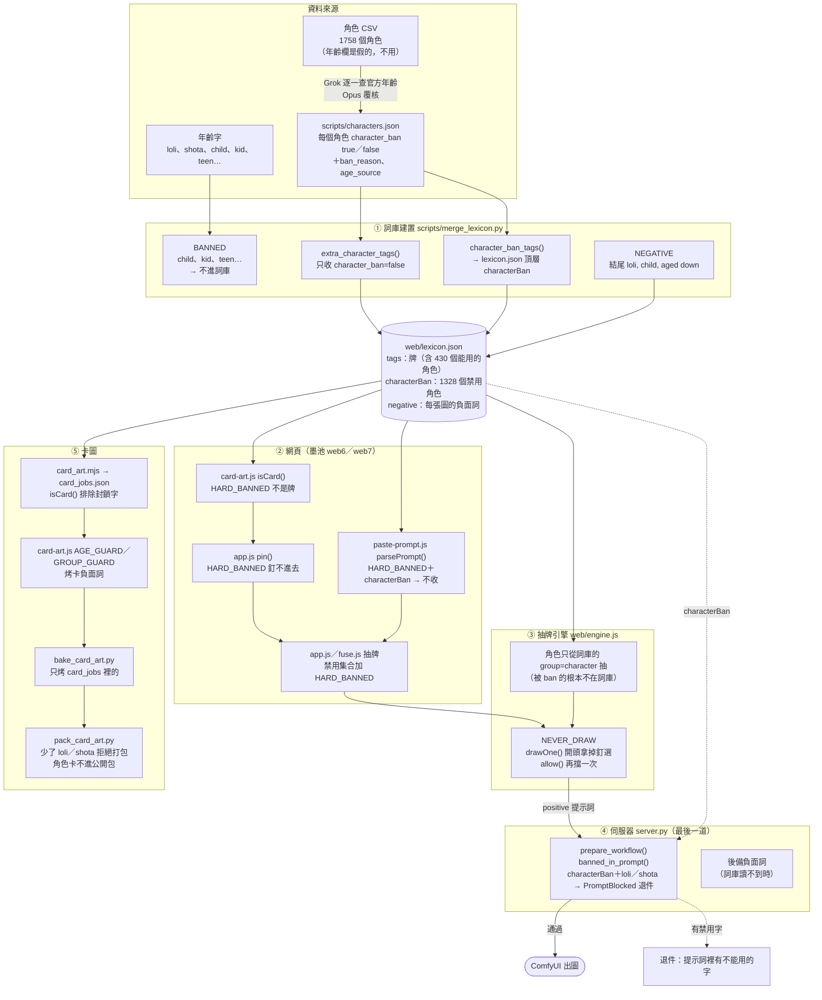
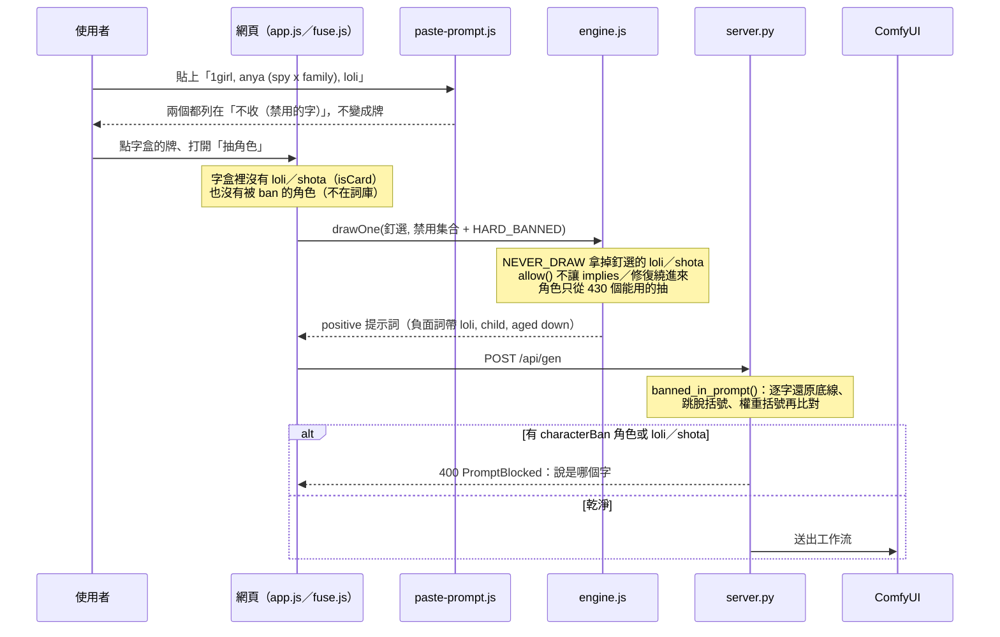

# 未成年規範

這個工具**不畫看起來未成年的人**。分兩類擋：

- **年齡字**：`loli`、`shota` 是底線封鎖，隨機抽不到、釘了也不輸出、不做成卡、不烤卡圖、不打包；`child`、`kid`、`teen` 這類字連詞庫都進不來。
- **角色**（2026-10-10 起）：1758 個動漫角色裡，未成年、學生、外觀像兒童、真人／VTuber、非人形、年齡查不到的 1328 個標 `character_ban`。它們不是牌、抽不到、貼上收不進來，伺服器也會退件。

這份文件列出每一層在哪裡擋、怎麼擋。改到任何一處之前先讀這份。

整理日期：2026-10-10（Opus）。行號是當天的，改過檔案會漂，以函式名稱為準。

---

## 總覽圖



### 一張圖從頭到尾經過哪些關卡



---

## 〇、兩份清單：誰吃、誰不吃

### `HARD_BANNED`（年齡字）

定義在 `web/card-art.js` 第 10 行：

```js
export const HARD_BANNED = Object.freeze(["loli", "shota"]);
```

**改這一行會影響下面「吃」的全部**；「不吃」的那些各自寫死一份清單，**不會跟著變**，要另外改。

吃 `HARD_BANNED` 的：

| # | 位置 | 誰在用 | 效果 |
|---|---|---|---|
| 1 | `web/card-art.js:11` `HARD` → `isCard()`（91 行） | 所有呼叫 `isCard()` 的（#9–#11） | 封鎖字不是卡 |
| 2 | `web/tag-cards.js:12,18` `artSrc()` | 中控室 web～web5 | 封鎖字**不給卡圖**（只擋卡圖，不擋詞庫按鈕，見「已知缺口 1」） |
| 3 | `web6/app.js:990`、`web7/app.js:931` `pin()` | 墨池 | 釘不進去 |
| 4 | `web6/app.js:1784`、`web7/app.js:1715` | 墨池抽牌 | 加進禁用集合再交給引擎 |
| 5 | `web6/fuse.js:345`、`web7/fuse.js:329` | 疊印台抽牌 | 同上 |
| 6 | `web6/app.js:2811`、`web7/app.js:2685` | 從作品冊、牌組帶牌回墨池 | 跳過封鎖字 |
| 7 | `web6/paste-prompt.js:78,104`（web7 同一份） | 貼上提示詞 | 列在「不收（禁用的字）」 |
| 8 | `scripts/pack_card_art.py` `hard_banned()` | 打包卡圖 | 從**已 commit 的** `card-art.js` 讀；讀不到或少了 loli／shota 就**拒絕打包** |
| 9 | `scripts/card_art.mjs:35` `cardArtJobs()` | 產烤卡工作清單 | 經 `isCard()`：不產工作 → `bake_card_art.py` 永遠不畫 |
| 10 | `web/card-art.js:525` `artPrompt()` | 插畫 prompt | 經 `isCard()`：回傳 null |
| 11 | `web6/cards.js` `buildLibrary()` | 墨池、疊印台、卡冊的字盒 | 經 `isCard()`：沒有這兩張牌 |
| 12 | `scripts/test_card_art.mjs:28,29,34,183` | 測試 | 清單有兩個字；不是牌、沒有插畫 prompt；工作清單沒漏；本機 manifest 沒有它們 |

不吃 `HARD_BANNED`、各自一份的：

| 位置 | 自己那份清單 | 管什麼 |
|---|---|---|
| `web/engine.js:4157` `NEVER_DRAW` | `loli, shota` | **所有房間的抽牌**：隨機、釘選都不輸出。真正讓圖裡不出現的那一層 |
| `server.py:1741` `_HARD_BANNED` | `loli, shota` | `/api/gen` 最後一道（見第 4 節） |
| `web/card-art.js:574` `AGE_GUARD` | `loli, shota, child, aged down, teenage, kid, toddler` | 烤卡圖的負面詞 |
| `scripts/merge_lexicon.py:99` `NEGATIVE` | 結尾 `loli, child, aged down` | 每張圖的負面詞（寫進 `lexicon.json` 的 `negative`） |
| `server.py:155` 後備負面詞 | 同上 | 詞庫讀不到時用；`test_server.py` 比對兩者 |
| `scripts/merge_lexicon.py:113` `BANNED` | `toddler, underage, kid, child(ren), teen, teenage(r)` | 不進詞庫（**不含** loli、shota） |
| `scripts/harvest_prompts.py:126` `BANNED_SUB` | 子字串 `loli, shota, child, toddler, underage, kid…` | 收語料時跳過 |
| `scripts/rename_custom_tag.py:54` `new_tag_ok()` | `BANNED`＋名字含 `loli`／`shota` | 擋改名 |
| `zipu/pool.js:37–38` `EXCLUDE_GROUPS`、`EXCLUDE_TAGS` | 整組 `body_f`、`body_m`；`loli` 等 | 字鋪不選這些字 |
| `web/boot.js`（中控室詞庫列表） | **沒有** | 蘿莉、正太照樣列出、能點（見「已知缺口 1」） |

所以 loli／shota 在程式裡寫了**四份**：`HARD_BANNED`（卡片、網頁）、`NEVER_DRAW`（引擎）、`_HARD_BANNED`（伺服器）、`zipu/pool.js`（字鋪）。

### `characterBan`（角色）

唯一來源是 `scripts/characters.json` 每一筆的 `character_ban`。`merge_lexicon.py` 產詞庫時拆成兩份：

| 位置 | 做什麼 |
|---|---|
| `scripts/merge_lexicon.py:5144` `extra_character_tags()` | 只把 `character_ban: false` 的做成牌（`subject`／`character`）。被 ban 的**不在 `tags` 裡**，所以字盒、引擎、卡圖全都碰不到 |
| `scripts/merge_lexicon.py:5184` `character_ban_tags()` → `lexicon.json` 頂層 `characterBan` | 被 ban 的名字清單（小寫、空格格式、排序去重），給下面兩個用 |
| `web6/paste-prompt.js:78` `parsePrompt({ banned })` | 墨池、疊印台、卡盒貼上時傳 `data.characterBan`：列在「不收」 |
| `server.py:1745` `character_ban()` | 讀 `lexicon.json` 的 `characterBan`（檔案改了自動重讀），給 `banned_in_prompt()` 用 |

---

## 一、各層在哪裡擋

### 1. 角色名單（`scripts/characters.json`）

- 1758 筆一個都不少，順序跟 CSV 一樣。CSV 的「年齡 age」欄是假的（全部 18～25，安妮亞寫 24），**完全不用**，年齡一律查官方設定。
- `character_ban: true` 的條件（寧可錯殺）：

| `ban_reason` | 條件 | 數量 |
|---|---|---|
| `student` | 在學的小學、國中、高中生（含高三、剛好 18） | 466 |
| `minor` | 官方未滿 18 歲；或同一個 tag 大量畫成未成年時期（路飛、烏索普兩年前 17，宇智鼬第一部 17） | 300 |
| `unsure` | 年齡查不到、說法矛盾、沒把握 | 217 |
| `childlike` | 外觀像兒童，不管幾歲（忍野忍、姬絲秀忒、芙莉蓮、東方的蕾米莉亞） | 133 |
| `non_human` | 動物、寶可夢本身、吉祥物、機體 | 113 |
| `real_person` | 真人或真人化身（Hololive、Nijisanji 全部） | 99 |

- 能用的 430 個，`age_source` 都寫了官方年齡與出處，或「成年（官方未公布確切年齡；角色定位與外觀皆為成年）」。
- 判斷流程：Grok 逐一查（`GROK_CHARACTERS.md`），Opus 覆核（`討論區.md` 2026-10-10）。

### 2. 詞庫建置（字能不能進詞庫）

| 檔案 | 做什麼 |
|---|---|
| `scripts/merge_lexicon.py` `BANNED` | `toddler`、`underage`、`kid`、`child`、`children`、`teen`、`teenage`、`teenager` 不進詞庫。精確比對，所以單數、複數各寫一次 |
| `scripts/merge_lexicon.py` `extra_character_tags()`、`character_ban_tags()` | 被 ban 的角色不成牌，名字進 `characterBan` |
| `scripts/harvest_prompts.py` `BANNED_SUB` | 從外部語料收新字時，名字**含有** `loli`、`shota`、`child`、`toddler`、`underage`、`kid` 等子字串的一律跳過 |
| `scripts/rename_custom_tag.py` `new_tag_ok()` | 改名時擋 `BANNED` 裡的字，以及名字含 `loli`、`shota` 的字 |

`loli`、`shota` 本身**仍在詞庫裡**（`loli` implies `petite`、`flat chest`，`shota` implies `short male`）。留著是為了互斥關係算得到（例如 loli 跟 tall female 互斥）。擋它們的是引擎、卡片、伺服器，不是詞庫。

### 3. 抽牌引擎（圖裡會不會出現）

| 位置 | 做什麼 |
|---|---|
| `web/engine.js:4157` `NEVER_DRAW` | `new Set(["loli", "shota"])`，所有房間共用 |
| `drawOne()` 開頭（4161 行） | 釘選集合裡的 loli、shota 直接拿掉 |
| `allow()`（4636 行） | 再擋一次，避免 implies、修復、必抽繞進來 |
| 抽角色（`drawOne()` 裡 `settings.drawCharacter`） | 只從詞庫的 `subject:character` 抽。被 ban 的角色不在詞庫，**不需要另外判斷**也抽不到；釘選也一樣（`applyPin` 找不到這個字） |

### 4. 伺服器（最後一道，跟畫面無關）

| 位置 | 做什麼 |
|---|---|
| `server.py:1763` `banned_in_prompt()` | 把提示詞逐字還原：`\(` `\)` 跳脫、底線換空格、外層權重括號與 `:1.2` 拿掉、大小寫統一，再比對 `_HARD_BANNED` 和 `characterBan` |
| `server.py:1785` `prepare_workflow()` 開頭 | 有任何一個就丟 `PromptBlocked`（「提示詞裡有不能用的字（未成年、真人等角色不收）：…」）。一般生圖、Hires、自己的工作流都走這裡 |
| `server.py:4411` `/api/gen` | `PromptBlocked` 回 400；串流（SSE）版本由 `gen_events()` 的 `ValueError` 分支回錯誤事件 |

這一層擋的是**繞過網頁**的情況：自己組請求、改了前端、用別的工具打 API。

### 5. 負面提示詞（生圖時往外推）

| 位置 | 內容 |
|---|---|
| `scripts/merge_lexicon.py` `NEGATIVE` → `web/lexicon.json` 的 `negative` | 結尾 `loli, child, aged down`，每張圖都帶 |
| `server.py:155` 後備負面詞 | 詞庫讀不到時用，內容相同；`scripts/test_server.py` 比對兩者 |
| `web/card-art.js:574` `AGE_GUARD` | 烤卡圖時，有人的牌（含角色牌）再加 `loli, shota, child, aged down, teenage, kid, toddler` |
| `web/card-art.js:576` `GROUP_GUARD` | 多人的牌再加 `family, mother and daughter, father and son, siblings, height difference`（小孩常從「全家福」構圖混進來） |

### 6. 卡片與卡圖

| 位置 | 做什麼 |
|---|---|
| `web/card-art.js` `isCard()` | 封鎖字不是卡 |
| `web/card-art.js:531` `artPrompt()` 角色分支 | 角色卡面固定接 `solo, adult, upper body, looking at viewer, simple background, white background, sfw, general`（只寫角色名，WAI 會畫成背影翹臀） |
| `scripts/card_art.mjs` | 產 `scripts/card_jobs.json` 時跳過封鎖字；角色工作標 `kind: "character"` |
| `scripts/bake_card_art.py` | 只烤 `card_jobs.json` 裡的；角色要 `--kind character` 另外烤，不混進「全年齡缺的直接烘」 |
| `scripts/pack_card_art.py` | 讀 `HARD_BANNED`，少了 loli／shota 拒絕打包；角色卡（`kind: character`）一律不進公開包 |
| `web/tag-cards.js` | 中控室：封鎖字不給卡圖 |

### 7. 字鋪（zipu）

`zipu/pool.js` 的 `EXCLUDE_TAGS` 有 `loli`，`EXCLUDE_GROUPS` 整組排除 `body_f`、`body_m`（`shota` 在 `body_m` 裡）。

### 8. 測試

| 測試 | 守什麼 |
|---|---|
| `scripts/test_card_art.mjs` | `HARD_BANNED` 有 loli、shota；烤卡工作沒漏進這兩個字；本機 manifest 沒有它們 |
| `scripts/test_engine.mjs:2134` 附近 | 釘 loli 時圖裡不會出現 loli |
| `scripts/test_engine.mjs:9341` 起（角色） | 抽角色關著不會抽到角色；`characterBan` 有清單、含安妮亞；被 ban 的不是牌；釘被 ban 的角色不會出現 |
| `scripts/test_server.py:591` 起 | `characterBan` 讀得到；跳脫括號、底線、權重括號都認得出被 ban 的角色；loli、shota 照擋；能用的角色不擋；被 ban 的送不出去 |
| `scripts/test_server.py` | 後備負面詞跟 `merge_lexicon.NEGATIVE` 一致 |
| `scripts/test_mochi_engine.mjs`（開源版 `tests/test_engine_release.mjs`） | 抽牌不出現 loli／shota／teen／child；抽角色關著不抽角色；被 ban 的不是牌 |

---

## 二、2026-09-29 本機清理（沿革）

`test_card_art` 當時抓到本機 `web/cards/manifest.json` 裡有 `loli`、`shota` 兩筆（`web/cards/` 不進 git）。只動本機檔案：

| 動作 | 檔案 |
|---|---|
| 整份備份 | `web/cards/manifest.before-hardban.json` |
| 從清單拿掉兩筆 | `web/cards/manifest.json` |
| 卡圖、縮圖搬走 | `web/cards/_hard_banned/`（`loli.webp`、`shota.webp`、`thumb/`、`mini/`） |

---

## 三、已知缺口（還沒修）

1. **中控室詞庫列表仍顯示蘿莉、正太。** `web/boot.js`（web～web5 共用）的詞庫裡這兩個字顯示成「池中」，也能點。引擎會丟掉，不會真的進圖，伺服器也會退件，但畫面會誤導人。墨池、疊印台沒有這個問題。
2. **釘「蘿莉」會留下它帶出的字。** `applyPin` 釘 loli 時會連帶釘上 `petite`、`flat chest`；loli 本身不輸出，這兩個會留在圖裡。`test_engine.mjs:2134` 刻意守著這個行為。要不要改由專案主決定。
3. **角色名單靠人判斷。** `character_ban` 是 Grok 逐一查、Opus 覆核的結果，「沒把握就 ban」會錯殺一些成年角色，但不會反過來放行。看到判錯的，改 `scripts/characters.json` 的 `character_ban` 後重跑詞庫（見下方檢查清單）。
4. **擋的是名字，不是畫面。** 有人用一般 tag 自己描述小孩的樣子，不在角色清單的範圍，由年齡字封鎖和負面詞處理。

---

## 四、改動時的檢查清單

- **加新的年齡相關字**：同時加進 `merge_lexicon.py` 的 `BANNED`（單複數各一）和 `harvest_prompts.py` 的 `BANNED_SUB`，再重產詞庫。
- **要封鎖已在詞庫裡的字**：四份一起改——`engine.js` 的 `NEVER_DRAW`（抽牌）、`card-art.js` 的 `HARD_BANNED`（卡片、網頁，連帶第〇節「吃」的全部）、`server.py` 的 `_HARD_BANNED`（伺服器）、`zipu/pool.js` 的 `EXCLUDE_TAGS`（字鋪）。只改其中一份，其他路徑還是放得進去。
- **改角色的 ban**：只改 `scripts/characters.json` 的 `character_ban`（放行要補 `age_source`），然後
  1. `python scripts/merge_lexicon.py`、`python scripts/add_zh.py`
  2. `node scripts/card_art.mjs --write`
  3. `python scripts/export_lexicon_xlsx.py`（詞庫表的「角色」「角色禁用」兩張跟著更新）
  4. `node scripts/test_engine.mjs`、`python scripts/test_server.py`
  5. 開源版：`python scripts/sync_mochi.py`
- **改負面詞**：`merge_lexicon.NEGATIVE` 和 `server.py` 的後備要一起改，`test_server.py` 會比對。
- **重烤或下載卡圖之後**：跑 `node scripts/test_card_art.mjs`，確認 manifest 裡沒有封鎖字。
- **新房間**：抽牌一律走 `engine.js`（`NEVER_DRAW`、角色只從詞庫抽，自動生效）；有字盒或卡片的用 `isCard()` 過濾；有貼上提示詞的，把 `data.characterBan` 傳給 `parsePrompt`。送出生圖一律經過 `server.py` 的 `prepare_workflow()`。
